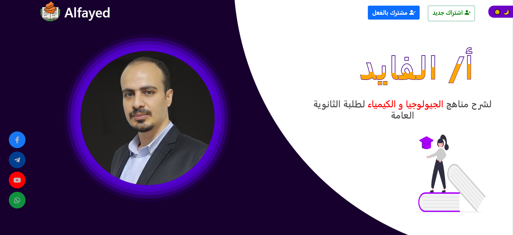

# Educationl Platform
> It is an educational online platform for students in Chemistry and Geology it is now owned for Mr.Alfayed...
>- Videos demo and Full description [_here_](https://drive.google.com/drive/folders/1-wji3srZPqRxGEz3pByqfGXDy5g-S8m-?usp=share_link).

## Table of Contents

* [General Info](#general-information)
* [Technologies Used](#technologies-used)
* [Features](#features)
* [Screenshots](#screenshots)
* [Project Status](#project-status)

## General Information
- It is a personal educational platform for Mr.Alfayed to teach Chemistry and Geology to students.
- I developed only the Front End pages and Back End  by my friend : Hady Taha.
- This only the code and files for front End.
- I developed it from Scratch.

## Technologies Used

- Front End - HTML5 , CSS3 , JavaScript, Bootstrap, Videos Library and Font awesome.
- Back End - Python and Dijango but not by me.

## Features

- This educational platform consists of 19 pages for Students and 13 pages for Admins.
- It provides Courses , Questions , Quizes and Summaries for each grade.
- Following and tracking the students and help them to get all their rights.
- Powerful videos library and secureing videos.
- It was based on MVC Arch.

## Screenshots

## Project Status
Project is: _complete_ 

